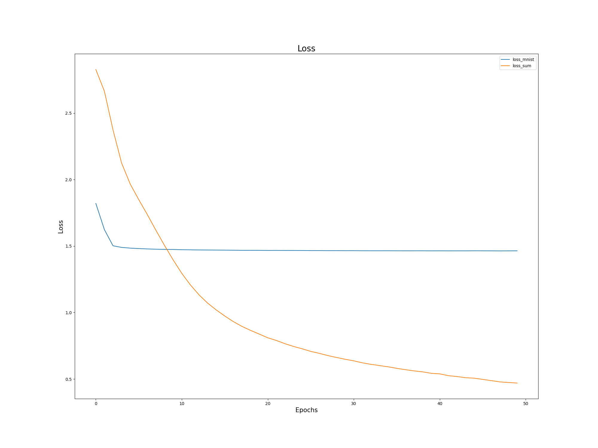

# TSAI EVA8
## Phase 1 - Assignment 2.5
---
## Architecture used

---
## Data representation
<br/>
MNIST data is downloaded from torchvision dataset link in the format of training.pt and test.pt where both files are numpy Binary file. Here, the images have 1 channel represented by a 28x28 matrix. The number of images are 6000 per label. There are a total of 10 labels (0-9), hence 60000 total images in the train dataset. Similarly, we have a separate test dataset of 10000 images with equal bin size per label.

Random numbers are generated for each individual labels of train and test set. This is fed into the model via DataLoaders (torch.data.utils).

---
## How have we combined the two inputs?
<br/>
We pass the image and the randomly generated number to the model as inputs, where we predict the input to the label and then stack the MNIST predicted label with the randomly generated number assigned for that image. This has been done inside the model to create a dataset for further prediction of the summation function.

---
## How are we evaluating our results?
<br/>
To evaluate the results, we calculate the total number of predictions that exactly match the labels (torchmetrics.Accuracy) <i>MNIST predicted label</i> and the <i>MNIST + random number predicted label</i>. Further, we add the loss from both prdeictions to understand how the loss is being minimized.

---
## What results did we finally get and how did we evaluate our results?
<br/>

```
Epoch: 01 | m_mnist_accuracy: 99.13% | m_sum_accuracy: 87.05%
```
m_mnist_accuracy are the number of MNIST labels correctly predicted by our model which is 99.13% while m_sum_accuracy is the number of correctly predicted labels for MNIST label + Random number. Our model is correctly predicting it upto 87.05%

---
## Training Logs
### Image Logs
<br/>
<b>Loss Function for training</b>

<br/>
<br/>
<br/>
<b>Accuracy for training</b>


### Text Logs

```
Training on GPU
Training LeNet...
Epoch: 01 | m_mnist_accuracy: 70.28% | m_sum_accuracy: 9.82%
Epoch: 02 | m_mnist_accuracy: 96.30% | m_sum_accuracy: 10.90%
Epoch: 03 | m_mnist_accuracy: 97.40% | m_sum_accuracy: 17.72%
Epoch: 04 | m_mnist_accuracy: 97.93% | m_sum_accuracy: 31.14%
Epoch: 05 | m_mnist_accuracy: 98.28% | m_sum_accuracy: 38.97%
Epoch: 06 | m_mnist_accuracy: 98.58% | m_sum_accuracy: 41.44%
Epoch: 07 | m_mnist_accuracy: 98.70% | m_sum_accuracy: 49.51%
Epoch: 08 | m_mnist_accuracy: 98.84% | m_sum_accuracy: 63.09%
Epoch: 09 | m_mnist_accuracy: 99.00% | m_sum_accuracy: 68.19%
Epoch: 10 | m_mnist_accuracy: 99.05% | m_sum_accuracy: 70.43%
Epoch: 11 | m_mnist_accuracy: 99.15% | m_sum_accuracy: 69.40%
Epoch: 12 | m_mnist_accuracy: 99.22% | m_sum_accuracy: 70.01%
Epoch: 13 | m_mnist_accuracy: 99.31% | m_sum_accuracy: 73.07%
Epoch: 14 | m_mnist_accuracy: 99.32% | m_sum_accuracy: 74.42%
Epoch: 15 | m_mnist_accuracy: 99.40% | m_sum_accuracy: 76.11%
Epoch: 16 | m_mnist_accuracy: 99.44% | m_sum_accuracy: 76.21%
Epoch: 17 | m_mnist_accuracy: 99.47% | m_sum_accuracy: 79.44%
Epoch: 18 | m_mnist_accuracy: 99.52% | m_sum_accuracy: 79.14%
Epoch: 19 | m_mnist_accuracy: 99.51% | m_sum_accuracy: 82.99%
Epoch: 20 | m_mnist_accuracy: 99.56% | m_sum_accuracy: 83.14%
Epoch: 21 | m_mnist_accuracy: 99.54% | m_sum_accuracy: 83.24%
Epoch: 22 | m_mnist_accuracy: 99.58% | m_sum_accuracy: 83.26%
Epoch: 23 | m_mnist_accuracy: 99.62% | m_sum_accuracy: 83.62%
Epoch: 24 | m_mnist_accuracy: 99.64% | m_sum_accuracy: 83.33%
Epoch: 25 | m_mnist_accuracy: 99.67% | m_sum_accuracy: 83.60%
Epoch: 26 | m_mnist_accuracy: 99.68% | m_sum_accuracy: 83.77%
Epoch: 27 | m_mnist_accuracy: 99.65% | m_sum_accuracy: 83.85%
Epoch: 28 | m_mnist_accuracy: 99.69% | m_sum_accuracy: 83.36%
Epoch: 29 | m_mnist_accuracy: 99.68% | m_sum_accuracy: 83.35%
Epoch: 30 | m_mnist_accuracy: 99.71% | m_sum_accuracy: 84.71%
Epoch: 31 | m_mnist_accuracy: 99.72% | m_sum_accuracy: 83.38%
Epoch: 32 | m_mnist_accuracy: 99.67% | m_sum_accuracy: 83.92%
Epoch: 33 | m_mnist_accuracy: 99.76% | m_sum_accuracy: 83.53%
Epoch: 34 | m_mnist_accuracy: 99.77% | m_sum_accuracy: 84.60%
Epoch: 35 | m_mnist_accuracy: 99.76% | m_sum_accuracy: 84.06%
Epoch: 36 | m_mnist_accuracy: 99.75% | m_sum_accuracy: 84.05%
Epoch: 37 | m_mnist_accuracy: 99.73% | m_sum_accuracy: 85.13%
Epoch: 38 | m_mnist_accuracy: 99.75% | m_sum_accuracy: 84.76%
Epoch: 39 | m_mnist_accuracy: 99.78% | m_sum_accuracy: 85.86%
Epoch: 40 | m_mnist_accuracy: 99.78% | m_sum_accuracy: 85.31%
Epoch: 41 | m_mnist_accuracy: 99.75% | m_sum_accuracy: 86.50%
Epoch: 42 | m_mnist_accuracy: 99.78% | m_sum_accuracy: 87.46%
Epoch: 43 | m_mnist_accuracy: 99.81% | m_sum_accuracy: 87.04%
Epoch: 44 | m_mnist_accuracy: 99.80% | m_sum_accuracy: 87.49%
Epoch: 45 | m_mnist_accuracy: 99.81% | m_sum_accuracy: 87.52%
Epoch: 46 | m_mnist_accuracy: 99.79% | m_sum_accuracy: 87.30%
Epoch: 47 | m_mnist_accuracy: 99.81% | m_sum_accuracy: 87.52%
Epoch: 48 | m_mnist_accuracy: 99.80% | m_sum_accuracy: 87.51%
Epoch: 49 | m_mnist_accuracy: 99.79% | m_sum_accuracy: 87.51%
Epoch: 50 | m_mnist_accuracy: 99.78% | m_sum_accuracy: 87.50%
Training Ended...
```

---
## What is the loss function that we picked and why?
<br/>
In the case of multiple-class classification, we can predict a probability for the example belonging to each of the classes, we have used a cross-entropy loss function, also referred to as Logarithmic loss. The problem is framed as predicting the likelihood of an example belonging to each class. We have used cross entropy loss since, the penalty is logarithmic, offering a small score for small differences (0.1 or 0.2) and enormous score for a large difference (0.9 or 1.0). Since the activation function for the output layer is Softmax and it is a continuously differentiable function, this makes it possible to calculate the derivative of the loss function with respect to every weight in the neural network. This property allows the model to adjust the weights accordingly to minimize the loss function (model output close to the true values).

---
## How did we train our Pytorch model on GPU?
<br/>
Attaching a screenshot of model training in GPU.
<br/>
<br/>
<b>Model Training on GPU</b>
<br/>

<br/>
<br/>
We have used the following code to check that.

```
# Move model to device
self.model = self.model.to(self.device)
print('Training on GPU' if self.model.cuda() else 'Training on CPU')
```
