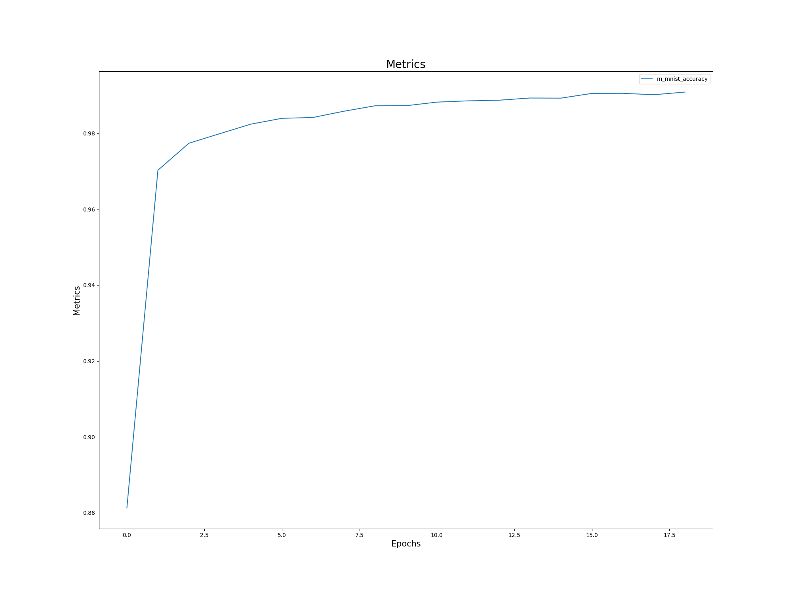

# TSAI EVA8
## Phase 1 - Assignment 3 [Part 2]
---
## Parameters used in model
```
----------------------------------------------------------------
        Layer (type)               Output Shape         Param #
================================================================
            Conv2d-1           [-1, 16, 28, 28]             160
              ReLU-2           [-1, 16, 28, 28]               0
            Conv2D-3           [-1, 16, 28, 28]               0
       BatchNorm2d-4           [-1, 16, 28, 28]              32
            Conv2d-5           [-1, 16, 28, 28]           2,320
              ReLU-6           [-1, 16, 28, 28]               0
            Conv2D-7           [-1, 16, 28, 28]               0
       BatchNorm2d-8           [-1, 16, 28, 28]              32
         AvgPool2d-9           [-1, 16, 14, 14]               0
          Dropout-10           [-1, 16, 14, 14]               0
        ConvBlock-11           [-1, 16, 14, 14]               0
           Conv2d-12           [-1, 16, 14, 14]           2,320
             ReLU-13           [-1, 16, 14, 14]               0
           Conv2D-14           [-1, 16, 14, 14]               0
      BatchNorm2d-15           [-1, 16, 14, 14]              32
           Conv2d-16           [-1, 16, 14, 14]           2,320
             ReLU-17           [-1, 16, 14, 14]               0
           Conv2D-18           [-1, 16, 14, 14]               0
      BatchNorm2d-19           [-1, 16, 14, 14]              32
        AvgPool2d-20             [-1, 16, 7, 7]               0
          Dropout-21             [-1, 16, 7, 7]               0
        ConvBlock-22             [-1, 16, 7, 7]               0
           Conv2d-23             [-1, 16, 7, 7]           2,320
             ReLU-24             [-1, 16, 7, 7]               0
           Conv2D-25             [-1, 16, 7, 7]               0
      BatchNorm2d-26             [-1, 16, 7, 7]              32
           Conv2d-27             [-1, 16, 7, 7]           2,320
             ReLU-28             [-1, 16, 7, 7]               0
           Conv2D-29             [-1, 16, 7, 7]               0
      BatchNorm2d-30             [-1, 16, 7, 7]              32
        AvgPool2d-31             [-1, 16, 3, 3]               0
          Dropout-32             [-1, 16, 3, 3]               0
        ConvBlock-33             [-1, 16, 3, 3]               0
           Conv2d-34             [-1, 10, 3, 3]             170
             ReLU-35             [-1, 10, 3, 3]               0
           Conv2D-36             [-1, 10, 3, 3]               0
           Linear-37                   [-1, 10]             910
       LogSoftmax-38                   [-1, 10]               0
            Dense-39                   [-1, 10]               0
================================================================
Total params: 13,032
Trainable params: 13,032
Non-trainable params: 0
----------------------------------------------------------------
Input size (MB): 0.00
Forward/backward pass size (MB): 1.10
Params size (MB): 0.05
Estimated Total Size (MB): 1.15
----------------------------------------------------------------
```
We have used a total of 13k parameters and have trained the model for 19 epochs.

Below is the training logs for the same
```
Training test_model_a...
Epoch: 01 | m_mnist_accuracy: 88.13%
Epoch: 02 | m_mnist_accuracy: 97.03%
Epoch: 03 | m_mnist_accuracy: 97.74%
Epoch: 04 | m_mnist_accuracy: 97.99%
Epoch: 05 | m_mnist_accuracy: 98.24%
Epoch: 06 | m_mnist_accuracy: 98.40%
Epoch: 07 | m_mnist_accuracy: 98.42%
Epoch: 08 | m_mnist_accuracy: 98.58%
Epoch: 09 | m_mnist_accuracy: 98.72%
Epoch: 10 | m_mnist_accuracy: 98.73%
Epoch: 11 | m_mnist_accuracy: 98.82%
Epoch: 12 | m_mnist_accuracy: 98.86%
Epoch: 13 | m_mnist_accuracy: 98.87%
Epoch: 14 | m_mnist_accuracy: 98.93%
Epoch: 15 | m_mnist_accuracy: 98.93%
Epoch: 16 | m_mnist_accuracy: 99.05%
Epoch: 17 | m_mnist_accuracy: 99.05%
Epoch: 18 | m_mnist_accuracy: 99.02%
Epoch: 19 | m_mnist_accuracy: 99.09%
Training Ended...
Testing test_model_a...
Epoch: 01 | m_mnist_accuracy: 99.25%
Testing Ended...
```
## Training Logs
### Image Logs
<br/>
<b>Loss Function for training</b>

<br/>
<br/>
<br/>
<b>Accuracy for training</b>

