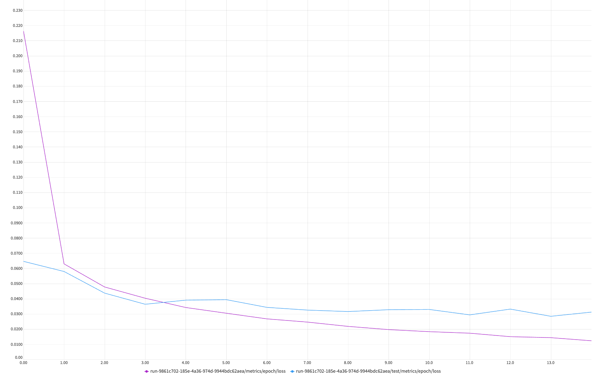
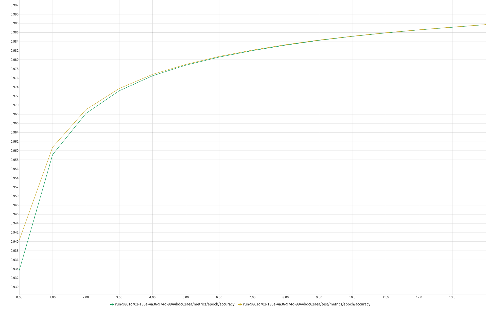
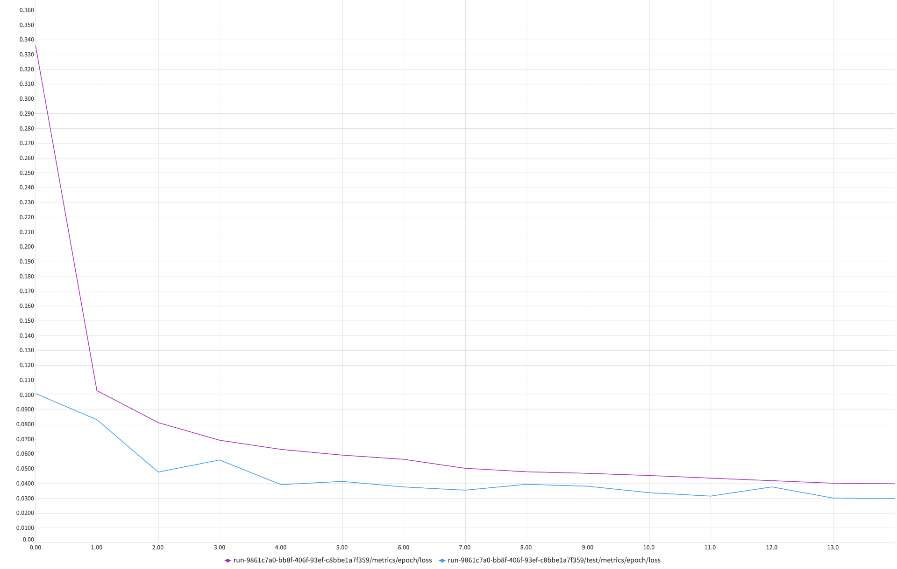
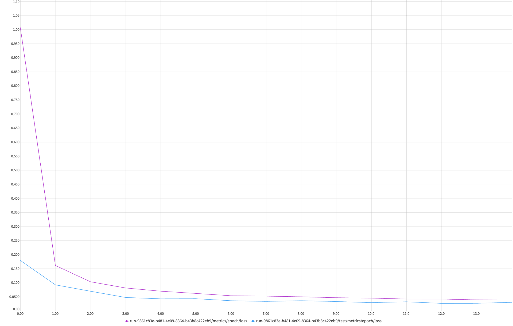
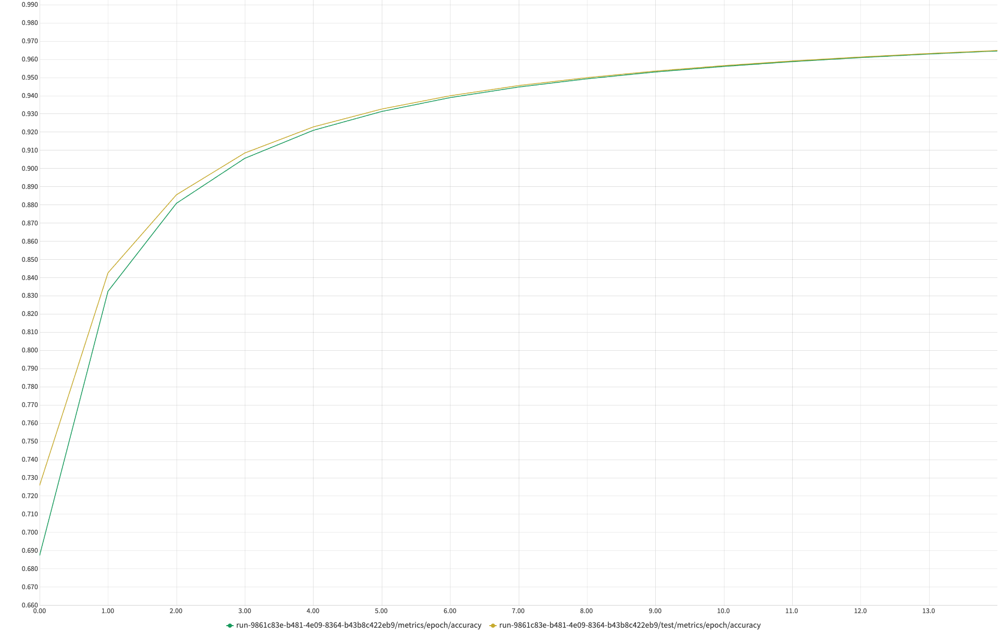
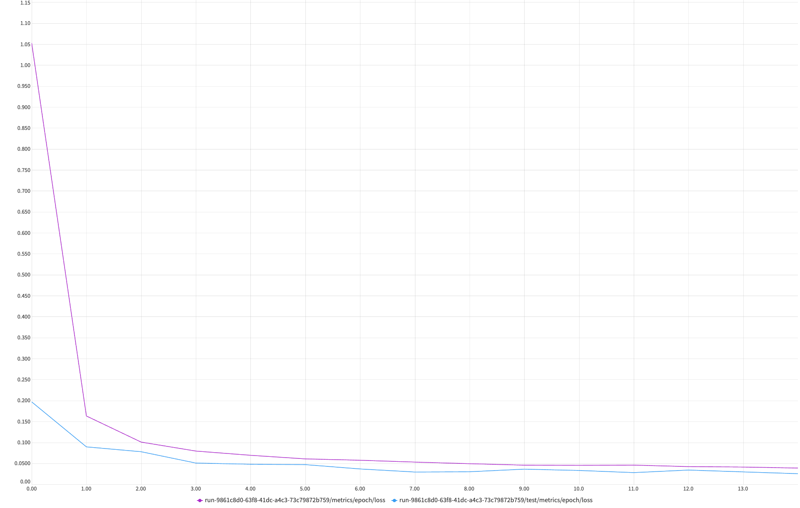
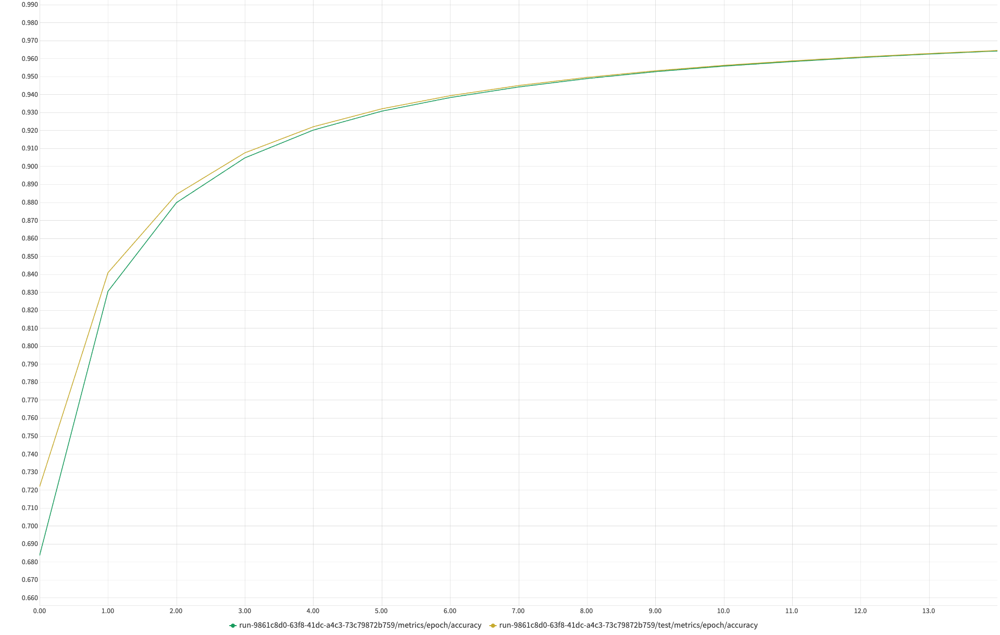

# TSAI EVA8
## Phase 1 - Assignment 4
---

## <em>Testing Model A</em>

This is the first model to be tested. We have only tried Batch Normalization along with the convolution layers

Below is the model summary for the model A
```
Model Summary
----------------------------------------------------------------
        Layer (type)               Output Shape         Param #
================================================================
            Conv2d-1           [-1, 10, 26, 26]              90
            Conv2D-2           [-1, 10, 26, 26]               0
       BatchNorm2d-3           [-1, 10, 26, 26]              20
              ReLU-4           [-1, 10, 26, 26]               0
         ConvBlock-5           [-1, 10, 26, 26]               0
            Conv2d-6           [-1, 10, 24, 24]             900
            Conv2D-7           [-1, 10, 24, 24]               0
       BatchNorm2d-8           [-1, 10, 24, 24]              20
              ReLU-9           [-1, 10, 24, 24]               0
        ConvBlock-10           [-1, 10, 24, 24]               0
           Conv2d-11           [-1, 20, 22, 22]           1,800
           Conv2D-12           [-1, 20, 22, 22]               0
      BatchNorm2d-13           [-1, 20, 22, 22]              40
             ReLU-14           [-1, 20, 22, 22]               0
        MaxPool2d-15           [-1, 20, 11, 11]               0
        ConvBlock-16           [-1, 20, 11, 11]               0
           Conv2d-17           [-1, 10, 11, 11]             200
           Conv2D-18           [-1, 10, 11, 11]               0
      BatchNorm2d-19           [-1, 10, 11, 11]              20
             ReLU-20           [-1, 10, 11, 11]               0
  TransitionBlock-21           [-1, 10, 11, 11]               0
           Conv2d-22             [-1, 10, 9, 9]             900
           Conv2D-23             [-1, 10, 9, 9]               0
      BatchNorm2d-24             [-1, 10, 9, 9]              20
             ReLU-25             [-1, 10, 9, 9]               0
        ConvBlock-26             [-1, 10, 9, 9]               0
           Conv2d-27             [-1, 10, 7, 7]             900
           Conv2D-28             [-1, 10, 7, 7]               0
      BatchNorm2d-29             [-1, 10, 7, 7]              20
             ReLU-30             [-1, 10, 7, 7]               0
        ConvBlock-31             [-1, 10, 7, 7]               0
           Conv2d-32             [-1, 10, 7, 7]             100
           Conv2D-33             [-1, 10, 7, 7]               0
      BatchNorm2d-34             [-1, 10, 7, 7]              20
             ReLU-35             [-1, 10, 7, 7]               0
  TransitionBlock-36             [-1, 10, 7, 7]               0
           Conv2d-37             [-1, 10, 1, 1]           4,900
           Conv2D-38             [-1, 10, 1, 1]               0
       LogSoftmax-39                   [-1, 10]               0
================================================================
Total params: 9,950
```

## Training Logs
### Image Logs
<br/>
<b>Loss logs for train & test</b>

<br/>
<br/>
<br/>
<b>Accuracy logs for train & test</b>


### Text Logs
```
--------------------------------
Train Epoch: 1 | Loss: 0.2166 | Accuracy: 93.37%
Test  Epoch: 1 | Loss: 0.0649 | Accuracy: 94.04%
--------------------------------
Train Epoch: 2 | Loss: 0.0632 | Accuracy: 95.92%
Test  Epoch: 2 | Loss: 0.0582 | Accuracy: 96.08%
--------------------------------
Train Epoch: 3 | Loss: 0.0480 | Accuracy: 96.82%
Test  Epoch: 3 | Loss: 0.0439 | Accuracy: 96.91%
--------------------------------
Train Epoch: 4 | Loss: 0.0406 | Accuracy: 97.32%
Test  Epoch: 4 | Loss: 0.0366 | Accuracy: 97.37%
--------------------------------
Train Epoch: 5 | Loss: 0.0345 | Accuracy: 97.65%
Test  Epoch: 5 | Loss: 0.0393 | Accuracy: 97.68%
--------------------------------
Train Epoch: 6 | Loss: 0.0307 | Accuracy: 97.88%
Test  Epoch: 6 | Loss: 0.0396 | Accuracy: 97.90%
--------------------------------
Train Epoch: 7 | Loss: 0.0270 | Accuracy: 98.06%
Test  Epoch: 7 | Loss: 0.0345 | Accuracy: 98.08%
--------------------------------
Train Epoch: 8 | Loss: 0.0249 | Accuracy: 98.20%
Test  Epoch: 8 | Loss: 0.0328 | Accuracy: 98.22%
--------------------------------
Train Epoch: 9 | Loss: 0.0220 | Accuracy: 98.33%
Test  Epoch: 9 | Loss: 0.0318 | Accuracy: 98.34%
--------------------------------
Train Epoch: 10 | Loss: 0.0199 | Accuracy: 98.43%
Test  Epoch: 10 | Loss: 0.0330 | Accuracy: 98.44%
--------------------------------
Train Epoch: 11 | Loss: 0.0185 | Accuracy: 98.52%
Test  Epoch: 11 | Loss: 0.0332 | Accuracy: 98.52%
--------------------------------
Train Epoch: 12 | Loss: 0.0175 | Accuracy: 98.59%
Test  Epoch: 12 | Loss: 0.0296 | Accuracy: 98.60%
--------------------------------
Train Epoch: 13 | Loss: 0.0153 | Accuracy: 98.66%
Test  Epoch: 13 | Loss: 0.0334 | Accuracy: 98.66%
--------------------------------
Train Epoch: 14 | Loss: 0.0146 | Accuracy: 98.72%
Test  Epoch: 14 | Loss: 0.0287 | Accuracy: 98.72%
--------------------------------
Train Epoch: 15 | Loss: 0.0125 | Accuracy: 98.78%
Test  Epoch: 15 | Loss: 0.0314 | Accuracy: 98.78%
--------------------------------
```
---
### Analysis
Targets:
 - Get the set-up right
 - Set Transforms
 - Set Data Loader
 - Set Basic Working Code
 - Set Basic Training & Test Loop

Results: (must include best train/test accuracies and total parameters)
 - Parameters: 9,950
 - Best Training Accuracy: 98.78%
 - Best Test Accuracy: 98.78%

Analysis:
 - No over-fitting, model is capable if pushed further

[Link to Model A](https://github.com/ankithaldar/tsai_eva8_assignments/blob/assign_4/eva8_phase01/assignment_4/src/model/test_model_a.py)

---
---
## <em>Testing Model B</em>

This is the Second model to be tested. We have tried Batch Normalization and Dropout along with the convolution layers

Below is the model summary for the model B
```
Model Summary
----------------------------------------------------------------
        Layer (type)               Output Shape         Param #
================================================================
            Conv2d-1           [-1, 16, 26, 26]             144
            Conv2D-2           [-1, 16, 26, 26]               0
       BatchNorm2d-3           [-1, 16, 26, 26]              32
              ReLU-4           [-1, 16, 26, 26]               0
           Dropout-5           [-1, 16, 26, 26]               0
         ConvBlock-6           [-1, 16, 26, 26]               0
            Conv2d-7           [-1, 16, 24, 24]           2,304
            Conv2D-8           [-1, 16, 24, 24]               0
       BatchNorm2d-9           [-1, 16, 24, 24]              32
             ReLU-10           [-1, 16, 24, 24]               0
          Dropout-11           [-1, 16, 24, 24]               0
        ConvBlock-12           [-1, 16, 24, 24]               0
           Conv2d-13           [-1, 10, 24, 24]             160
           Conv2D-14           [-1, 10, 24, 24]               0
      BatchNorm2d-15           [-1, 10, 24, 24]              20
             ReLU-16           [-1, 10, 24, 24]               0
  TransitionBlock-17           [-1, 10, 24, 24]               0
        MaxPool2d-18           [-1, 10, 12, 12]               0
           Conv2d-19           [-1, 10, 10, 10]             900
           Conv2D-20           [-1, 10, 10, 10]               0
      BatchNorm2d-21           [-1, 10, 10, 10]              20
             ReLU-22           [-1, 10, 10, 10]               0
          Dropout-23           [-1, 10, 10, 10]               0
        ConvBlock-24           [-1, 10, 10, 10]               0
           Conv2d-25             [-1, 10, 8, 8]             900
           Conv2D-26             [-1, 10, 8, 8]               0
      BatchNorm2d-27             [-1, 10, 8, 8]              20
             ReLU-28             [-1, 10, 8, 8]               0
          Dropout-29             [-1, 10, 8, 8]               0
        ConvBlock-30             [-1, 10, 8, 8]               0
           Conv2d-31             [-1, 10, 6, 6]             900
           Conv2D-32             [-1, 10, 6, 6]               0
      BatchNorm2d-33             [-1, 10, 6, 6]              20
             ReLU-34             [-1, 10, 6, 6]               0
          Dropout-35             [-1, 10, 6, 6]               0
        ConvBlock-36             [-1, 10, 6, 6]               0
           Conv2d-37             [-1, 10, 6, 6]             900
           Conv2D-38             [-1, 10, 6, 6]               0
      BatchNorm2d-39             [-1, 10, 6, 6]              20
             ReLU-40             [-1, 10, 6, 6]               0
          Dropout-41             [-1, 10, 6, 6]               0
        ConvBlock-42             [-1, 10, 6, 6]               0
           Conv2d-43             [-1, 10, 1, 1]           3,600
           Conv2D-44             [-1, 10, 1, 1]               0
       LogSoftmax-45                   [-1, 10]               0
================================================================
Total params: 9,972
```

## Training Logs
### Image Logs
<br/>
<b>Loss logs for train & test</b>

<br/>
<br/>
<br/>
<b>Accuracy logs for train & test</b>


### Text Logs
```
--------------------------------
Train Epoch: 1 | Loss: 0.3364 | Accuracy: 89.29%
Test  Epoch: 1 | Loss: 0.1011 | Accuracy: 90.37%
--------------------------------
Train Epoch: 2 | Loss: 0.1031 | Accuracy: 93.31%
Test  Epoch: 2 | Loss: 0.0834 | Accuracy: 93.61%
--------------------------------
Train Epoch: 3 | Loss: 0.0814 | Accuracy: 94.77%
Test  Epoch: 3 | Loss: 0.0480 | Accuracy: 94.95%
--------------------------------
Train Epoch: 4 | Loss: 0.0695 | Accuracy: 95.59%
Test  Epoch: 4 | Loss: 0.0562 | Accuracy: 95.68%
--------------------------------
Train Epoch: 5 | Loss: 0.0633 | Accuracy: 96.10%
Test  Epoch: 5 | Loss: 0.0395 | Accuracy: 96.17%
--------------------------------
Train Epoch: 6 | Loss: 0.0594 | Accuracy: 96.46%
Test  Epoch: 6 | Loss: 0.0417 | Accuracy: 96.51%
--------------------------------
Train Epoch: 7 | Loss: 0.0566 | Accuracy: 96.73%
Test  Epoch: 7 | Loss: 0.0379 | Accuracy: 96.77%
--------------------------------
Train Epoch: 8 | Loss: 0.0505 | Accuracy: 96.95%
Test  Epoch: 8 | Loss: 0.0358 | Accuracy: 96.98%
--------------------------------
Train Epoch: 9 | Loss: 0.0482 | Accuracy: 97.13%
Test  Epoch: 9 | Loss: 0.0397 | Accuracy: 97.15%
--------------------------------
Train Epoch: 10 | Loss: 0.0471 | Accuracy: 97.27%
Test  Epoch: 10 | Loss: 0.0384 | Accuracy: 97.29%
--------------------------------
Train Epoch: 11 | Loss: 0.0457 | Accuracy: 97.39%
Test  Epoch: 11 | Loss: 0.0341 | Accuracy: 97.41%
--------------------------------
Train Epoch: 12 | Loss: 0.0439 | Accuracy: 97.49%
Test  Epoch: 12 | Loss: 0.0317 | Accuracy: 97.51%
--------------------------------
Train Epoch: 13 | Loss: 0.0422 | Accuracy: 97.58%
Test  Epoch: 13 | Loss: 0.0380 | Accuracy: 97.60%
--------------------------------
Train Epoch: 14 | Loss: 0.0405 | Accuracy: 97.66%
Test  Epoch: 14 | Loss: 0.0304 | Accuracy: 97.68%
--------------------------------
Train Epoch: 15 | Loss: 0.0401 | Accuracy: 97.74%
Test  Epoch: 15 | Loss: 0.0302 | Accuracy: 97.75%
--------------------------------
```
---
### Analysis
Targets:
 - Add Dropout

Results: (must include best train/test accuracies and total parameters)
 - Parameters: 9,982
 - Best Training Accuracy: 97.74%
 - Best Test Accuracy: 97.75%

Analysis:
 - Dropout not working.
 - No over-fitting, model is capable if pushed further
 - We are also not using GAP, but depending on a BIG sized kernel

[Link to Model B](https://github.com/ankithaldar/tsai_eva8_assignments/blob/assign_4/eva8_phase01/assignment_4/src/model/test_model_b.py)

---
---
## <em>Testing Model C</em>

This is the Second model to be tested. We have tried Batch Normalization, Dropout & Global Average Pooling along with the convolution layers

Below is the model summary for the model C
```
Model Summary
----------------------------------------------------------------
        Layer (type)               Output Shape         Param #
================================================================
            Conv2d-1           [-1, 16, 26, 26]             144
            Conv2D-2           [-1, 16, 26, 26]               0
       BatchNorm2d-3           [-1, 16, 26, 26]              32
              ReLU-4           [-1, 16, 26, 26]               0
           Dropout-5           [-1, 16, 26, 26]               0
         ConvBlock-6           [-1, 16, 26, 26]               0
            Conv2d-7           [-1, 16, 24, 24]           2,304
            Conv2D-8           [-1, 16, 24, 24]               0
       BatchNorm2d-9           [-1, 16, 24, 24]              32
             ReLU-10           [-1, 16, 24, 24]               0
          Dropout-11           [-1, 16, 24, 24]               0
        ConvBlock-12           [-1, 16, 24, 24]               0
           Conv2d-13           [-1, 10, 24, 24]             160
           Conv2D-14           [-1, 10, 24, 24]               0
      BatchNorm2d-15           [-1, 10, 24, 24]              20
             ReLU-16           [-1, 10, 24, 24]               0
  TransitionBlock-17           [-1, 10, 24, 24]               0
        MaxPool2d-18           [-1, 10, 12, 12]               0
           Conv2d-19           [-1, 16, 10, 10]           1,440
           Conv2D-20           [-1, 16, 10, 10]               0
      BatchNorm2d-21           [-1, 16, 10, 10]              32
             ReLU-22           [-1, 16, 10, 10]               0
          Dropout-23           [-1, 16, 10, 10]               0
        ConvBlock-24           [-1, 16, 10, 10]               0
           Conv2d-25             [-1, 16, 8, 8]           2,304
           Conv2D-26             [-1, 16, 8, 8]               0
      BatchNorm2d-27             [-1, 16, 8, 8]              32
             ReLU-28             [-1, 16, 8, 8]               0
          Dropout-29             [-1, 16, 8, 8]               0
        ConvBlock-30             [-1, 16, 8, 8]               0
           Conv2d-31             [-1, 10, 6, 6]           1,440
           Conv2D-32             [-1, 10, 6, 6]               0
      BatchNorm2d-33             [-1, 10, 6, 6]              20
             ReLU-34             [-1, 10, 6, 6]               0
          Dropout-35             [-1, 10, 6, 6]               0
        ConvBlock-36             [-1, 10, 6, 6]               0
           Conv2d-37             [-1, 10, 6, 6]             900
           Conv2D-38             [-1, 10, 6, 6]               0
      BatchNorm2d-39             [-1, 10, 6, 6]              20
             ReLU-40             [-1, 10, 6, 6]               0
          Dropout-41             [-1, 10, 6, 6]               0
        ConvBlock-42             [-1, 10, 6, 6]               0
        AvgPool2d-43             [-1, 10, 1, 1]               0
           Conv2d-44             [-1, 10, 1, 1]             100
           Conv2D-45             [-1, 10, 1, 1]               0
       LogSoftmax-46                   [-1, 10]               0
================================================================
Total params: 8,980
```

## Training Logs
### Image Logs
<br/>
<b>Loss logs for train & test</b>

<br/>
<br/>
<br/>
<b>Accuracy logs for train & test</b>


### Text Logs
```
--------------------------------
Train Epoch: 1 | Loss: 1.0078 | Accuracy: 68.75%
Test  Epoch: 1 | Loss: 0.1803 | Accuracy: 72.60%
--------------------------------
Train Epoch: 2 | Loss: 0.1622 | Accuracy: 83.27%
Test  Epoch: 2 | Loss: 0.0935 | Accuracy: 84.29%
--------------------------------
Train Epoch: 3 | Loss: 0.1044 | Accuracy: 88.10%
Test  Epoch: 3 | Loss: 0.0708 | Accuracy: 88.57%
--------------------------------
Train Epoch: 4 | Loss: 0.0824 | Accuracy: 90.58%
Test  Epoch: 4 | Loss: 0.0487 | Accuracy: 90.87%
--------------------------------
Train Epoch: 5 | Loss: 0.0710 | Accuracy: 92.12%
Test  Epoch: 5 | Loss: 0.0438 | Accuracy: 92.30%
--------------------------------
Train Epoch: 6 | Loss: 0.0630 | Accuracy: 93.15%
Test  Epoch: 6 | Loss: 0.0442 | Accuracy: 93.29%
--------------------------------
Train Epoch: 7 | Loss: 0.0548 | Accuracy: 93.91%
Test  Epoch: 7 | Loss: 0.0371 | Accuracy: 94.02%
--------------------------------
Train Epoch: 8 | Loss: 0.0534 | Accuracy: 94.50%
Test  Epoch: 8 | Loss: 0.0346 | Accuracy: 94.58%
--------------------------------
Train Epoch: 9 | Loss: 0.0510 | Accuracy: 94.95%
Test  Epoch: 9 | Loss: 0.0372 | Accuracy: 95.01%
--------------------------------
Train Epoch: 10 | Loss: 0.0478 | Accuracy: 95.32%
Test  Epoch: 10 | Loss: 0.0342 | Accuracy: 95.37%
--------------------------------
Train Epoch: 11 | Loss: 0.0463 | Accuracy: 95.63%
Test  Epoch: 11 | Loss: 0.0303 | Accuracy: 95.67%
--------------------------------
Train Epoch: 12 | Loss: 0.0431 | Accuracy: 95.89%
Test  Epoch: 12 | Loss: 0.0333 | Accuracy: 95.93%
--------------------------------
Train Epoch: 13 | Loss: 0.0430 | Accuracy: 96.11%
Test  Epoch: 13 | Loss: 0.0277 | Accuracy: 96.15%
--------------------------------
Train Epoch: 14 | Loss: 0.0402 | Accuracy: 96.31%
Test  Epoch: 14 | Loss: 0.0280 | Accuracy: 96.34%
--------------------------------
Train Epoch: 15 | Loss: 0.0391 | Accuracy: 96.48%
Test  Epoch: 15 | Loss: 0.0313 | Accuracy: 96.50%
--------------------------------
```
---
### Analysis
Targets:
 - Add Regularization, Dropout, Global Average Pooling

Results: (must include best train/test accuracies and total parameters)
 - Parameters: 8,980
 - Best Training Accuracy: 96.48%
 - Best Test Accuracy: 96.50%

Analysis:
 - Dropout, Global Average Pooling not working.
 - No over-fitting, model is capable if pushed further

[Link to Model C](https://github.com/ankithaldar/tsai_eva8_assignments/blob/assign_4/eva8_phase01/assignment_4/src/model/test_model_c.py)


---
---
## <em>Testing Model D</em>

This is the Second model to be tested. We have tried Batch Normalization, Dropout, Global Average Pooling and LRScheduler along with the convolution layers

Below is the model summary for the model D
```
Model Summary
----------------------------------------------------------------
        Layer (type)               Output Shape         Param #
================================================================
            Conv2d-1           [-1, 16, 26, 26]             144
            Conv2D-2           [-1, 16, 26, 26]               0
       BatchNorm2d-3           [-1, 16, 26, 26]              32
              ReLU-4           [-1, 16, 26, 26]               0
           Dropout-5           [-1, 16, 26, 26]               0
         ConvBlock-6           [-1, 16, 26, 26]               0
            Conv2d-7           [-1, 16, 24, 24]           2,304
            Conv2D-8           [-1, 16, 24, 24]               0
       BatchNorm2d-9           [-1, 16, 24, 24]              32
             ReLU-10           [-1, 16, 24, 24]               0
          Dropout-11           [-1, 16, 24, 24]               0
        ConvBlock-12           [-1, 16, 24, 24]               0
           Conv2d-13           [-1, 10, 24, 24]             160
           Conv2D-14           [-1, 10, 24, 24]               0
      BatchNorm2d-15           [-1, 10, 24, 24]              20
             ReLU-16           [-1, 10, 24, 24]               0
  TransitionBlock-17           [-1, 10, 24, 24]               0
        MaxPool2d-18           [-1, 10, 12, 12]               0
           Conv2d-19           [-1, 16, 10, 10]           1,440
           Conv2D-20           [-1, 16, 10, 10]               0
      BatchNorm2d-21           [-1, 16, 10, 10]              32
             ReLU-22           [-1, 16, 10, 10]               0
          Dropout-23           [-1, 16, 10, 10]               0
        ConvBlock-24           [-1, 16, 10, 10]               0
           Conv2d-25             [-1, 16, 8, 8]           2,304
           Conv2D-26             [-1, 16, 8, 8]               0
      BatchNorm2d-27             [-1, 16, 8, 8]              32
             ReLU-28             [-1, 16, 8, 8]               0
          Dropout-29             [-1, 16, 8, 8]               0
        ConvBlock-30             [-1, 16, 8, 8]               0
           Conv2d-31             [-1, 10, 6, 6]           1,440
           Conv2D-32             [-1, 10, 6, 6]               0
      BatchNorm2d-33             [-1, 10, 6, 6]              20
             ReLU-34             [-1, 10, 6, 6]               0
          Dropout-35             [-1, 10, 6, 6]               0
        ConvBlock-36             [-1, 10, 6, 6]               0
           Conv2d-37             [-1, 10, 6, 6]             900
           Conv2D-38             [-1, 10, 6, 6]               0
      BatchNorm2d-39             [-1, 10, 6, 6]              20
             ReLU-40             [-1, 10, 6, 6]               0
          Dropout-41             [-1, 10, 6, 6]               0
        ConvBlock-42             [-1, 10, 6, 6]               0
        AvgPool2d-43             [-1, 10, 1, 1]               0
           Conv2d-44             [-1, 10, 1, 1]             100
           Conv2D-45             [-1, 10, 1, 1]               0
       LogSoftmax-46                   [-1, 10]               0
================================================================
Total params: 8,980
```

## Training Logs
### Image Logs
<br/>
<b>Loss logs for train & test</b>

<br/>
<br/>
<br/>
<b>Accuracy logs for train & test</b>


### Text Logs
```
--------------------------------
Train Epoch: 1 | Loss: 1.0536 | Accuracy: 68.38%
Test  Epoch: 1 | Loss: 0.1979 | Accuracy: 72.21%
--------------------------------
Train Epoch: 2 | Loss: 0.1643 | Accuracy: 83.08%
Test  Epoch: 2 | Loss: 0.0906 | Accuracy: 84.11%
--------------------------------
Train Epoch: 3 | Loss: 0.1020 | Accuracy: 88.01%
Test  Epoch: 3 | Loss: 0.0790 | Accuracy: 88.46%
--------------------------------
Train Epoch: 4 | Loss: 0.0806 | Accuracy: 90.50%
Test  Epoch: 4 | Loss: 0.0520 | Accuracy: 90.78%
--------------------------------
Train Epoch: 5 | Loss: 0.0705 | Accuracy: 92.04%
Test  Epoch: 5 | Loss: 0.0492 | Accuracy: 92.23%
--------------------------------
Train Epoch: 6 | Loss: 0.0619 | Accuracy: 93.09%
Test  Epoch: 6 | Loss: 0.0483 | Accuracy: 93.22%
--------------------------------
Train Epoch: 7 | Loss: 0.0587 | Accuracy: 93.85%
Test  Epoch: 7 | Loss: 0.0379 | Accuracy: 93.95%
--------------------------------
Train Epoch: 8 | Loss: 0.0543 | Accuracy: 94.44%
Test  Epoch: 8 | Loss: 0.0306 | Accuracy: 94.52%
--------------------------------
Train Epoch: 9 | Loss: 0.0505 | Accuracy: 94.91%
Test  Epoch: 9 | Loss: 0.0312 | Accuracy: 94.97%
--------------------------------
Train Epoch: 10 | Loss: 0.0470 | Accuracy: 95.29%
Test  Epoch: 10 | Loss: 0.0375 | Accuracy: 95.34%
--------------------------------
Train Epoch: 11 | Loss: 0.0466 | Accuracy: 95.60%
Test  Epoch: 11 | Loss: 0.0343 | Accuracy: 95.64%
--------------------------------
Train Epoch: 12 | Loss: 0.0471 | Accuracy: 95.85%
Test  Epoch: 12 | Loss: 0.0292 | Accuracy: 95.89%
--------------------------------
Train Epoch: 13 | Loss: 0.0435 | Accuracy: 96.08%
Test  Epoch: 13 | Loss: 0.0353 | Accuracy: 96.11%
--------------------------------
Train Epoch: 14 | Loss: 0.0425 | Accuracy: 96.27%
Test  Epoch: 14 | Loss: 0.0310 | Accuracy: 96.30%
--------------------------------
Train Epoch: 15 | Loss: 0.0401 | Accuracy: 96.44%
Test  Epoch: 15 | Loss: 0.0266 | Accuracy: 96.47%
--------------------------------
```
---
### Analysis
Targets:
 - Add Regularization, Dropout, Global Average Pooling & LR Scheduler

Results: (must include best train/test accuracies and total parameters)
 - Parameters: 8,980
 - Best Training Accuracy: 96.44%
 - Best Test Accuracy: 96.47%

Analysis:
 - Dropout, Global Average Pooling & LR Scheduler not working.
 - No over-fitting, model is capable if pushed further

[Link to Model D](https://github.com/ankithaldar/tsai_eva8_assignments/blob/assign_4/eva8_phase01/assignment_4/src/model/test_model_d.py)
