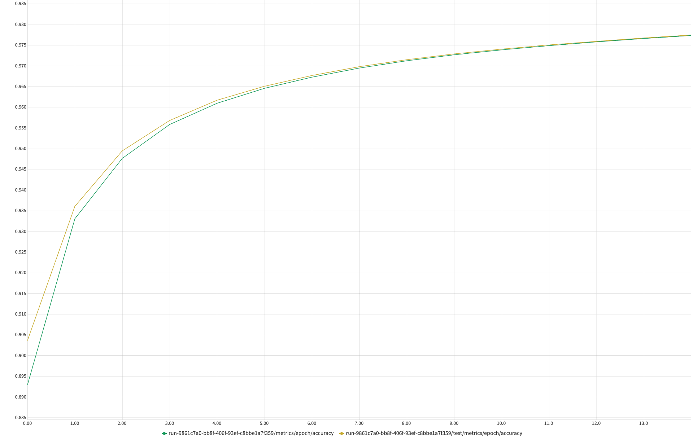

# TSAI EVA8
## Phase 1 - Assignment 4
---

## <em>Testing Model A</em>

This is the first model to be tested. We have only tried Batch Normalization along with the convolution layers

Below is the model summary for the model A
```
Model Summary
----------------------------------------------------------------
        Layer (type)               Output Shape         Param #
================================================================
            Conv2d-1           [-1, 10, 26, 26]              90
            Conv2D-2           [-1, 10, 26, 26]               0
       BatchNorm2d-3           [-1, 10, 26, 26]              20
              ReLU-4           [-1, 10, 26, 26]               0
         ConvBlock-5           [-1, 10, 26, 26]               0
            Conv2d-6           [-1, 10, 24, 24]             900
            Conv2D-7           [-1, 10, 24, 24]               0
       BatchNorm2d-8           [-1, 10, 24, 24]              20
              ReLU-9           [-1, 10, 24, 24]               0
        ConvBlock-10           [-1, 10, 24, 24]               0
           Conv2d-11           [-1, 20, 22, 22]           1,800
           Conv2D-12           [-1, 20, 22, 22]               0
      BatchNorm2d-13           [-1, 20, 22, 22]              40
             ReLU-14           [-1, 20, 22, 22]               0
        MaxPool2d-15           [-1, 20, 11, 11]               0
        ConvBlock-16           [-1, 20, 11, 11]               0
           Conv2d-17           [-1, 10, 11, 11]             200
           Conv2D-18           [-1, 10, 11, 11]               0
      BatchNorm2d-19           [-1, 10, 11, 11]              20
             ReLU-20           [-1, 10, 11, 11]               0
  TransitionBlock-21           [-1, 10, 11, 11]               0
           Conv2d-22             [-1, 10, 9, 9]             900
           Conv2D-23             [-1, 10, 9, 9]               0
      BatchNorm2d-24             [-1, 10, 9, 9]              20
             ReLU-25             [-1, 10, 9, 9]               0
        ConvBlock-26             [-1, 10, 9, 9]               0
           Conv2d-27             [-1, 10, 7, 7]             900
           Conv2D-28             [-1, 10, 7, 7]               0
      BatchNorm2d-29             [-1, 10, 7, 7]              20
             ReLU-30             [-1, 10, 7, 7]               0
        ConvBlock-31             [-1, 10, 7, 7]               0
           Conv2d-32             [-1, 10, 7, 7]             100
           Conv2D-33             [-1, 10, 7, 7]               0
      BatchNorm2d-34             [-1, 10, 7, 7]              20
             ReLU-35             [-1, 10, 7, 7]               0
  TransitionBlock-36             [-1, 10, 7, 7]               0
           Conv2d-37             [-1, 10, 1, 1]           4,910
           Conv2D-38             [-1, 10, 1, 1]               0
       LogSoftmax-39                   [-1, 10]               0
================================================================
Total params: 9,960
```

## Training Logs
### Image Logs
<br/>
<b>Loss logs for train & test</b>

<br/>
<br/>
<br/>
<b>Accuracy logs for train & test</b>


### Text Logs
```
Train Epoch: 1 | Loss: 0.2885 | Accuracy: 91.96%
Test  Epoch: 1 | Loss: 0.0790 | Accuracy: 92.80%
--------------------------------
Train Epoch: 2 | Loss: 0.0666 | Accuracy: 95.19%
Test  Epoch: 2 | Loss: 0.0582 | Accuracy: 95.41%
--------------------------------
Train Epoch: 3 | Loss: 0.0467 | Accuracy: 96.36%
Test  Epoch: 3 | Loss: 0.0410 | Accuracy: 96.46%
--------------------------------
Train Epoch: 4 | Loss: 0.0370 | Accuracy: 97.00%
Test  Epoch: 4 | Loss: 0.0366 | Accuracy: 97.06%
--------------------------------
Train Epoch: 5 | Loss: 0.0305 | Accuracy: 97.42%
Test  Epoch: 5 | Loss: 0.0432 | Accuracy: 97.45%
--------------------------------
Train Epoch: 6 | Loss: 0.0273 | Accuracy: 97.70%
Test  Epoch: 6 | Loss: 0.0335 | Accuracy: 97.72%
--------------------------------
Train Epoch: 7 | Loss: 0.0234 | Accuracy: 97.92%
Test  Epoch: 7 | Loss: 0.0389 | Accuracy: 97.94%
--------------------------------
Train Epoch: 8 | Loss: 0.0222 | Accuracy: 98.08%
Test  Epoch: 8 | Loss: 0.0400 | Accuracy: 98.09%
--------------------------------
Train Epoch: 9 | Loss: 0.0194 | Accuracy: 98.22%
Test  Epoch: 9 | Loss: 0.0334 | Accuracy: 98.23%
--------------------------------
Train Epoch: 10 | Loss: 0.0187 | Accuracy: 98.33%
Test  Epoch: 10 | Loss: 0.0329 | Accuracy: 98.34%
--------------------------------
Train Epoch: 11 | Loss: 0.0165 | Accuracy: 98.43%
Test  Epoch: 11 | Loss: 0.0359 | Accuracy: 98.43%
--------------------------------
Train Epoch: 12 | Loss: 0.0137 | Accuracy: 98.52%
Test  Epoch: 12 | Loss: 0.0346 | Accuracy: 98.52%
--------------------------------
Train Epoch: 13 | Loss: 0.0124 | Accuracy: 98.59%
Test  Epoch: 13 | Loss: 0.0368 | Accuracy: 98.60%
--------------------------------
Train Epoch: 14 | Loss: 0.0115 | Accuracy: 98.66%
Test  Epoch: 14 | Loss: 0.0412 | Accuracy: 98.66%
--------------------------------
Train Epoch: 15 | Loss: 0.0117 | Accuracy: 98.72%
Test  Epoch: 15 | Loss: 0.0360 | Accuracy: 98.72%
--------------------------------
```
---
### Analysis
Targets:
 - Get the set-up right
 - Set Transforms
 - Set Data Loader
 - Set Basic Working Code
 - Set Basic Training  & Test Loop

Results: (must include best train/test accuracies and total parameters)
 - Parameters: 9,960
 - Best Training Accuracy: 98.72%
 - Best Test Accuracy: 98.72%

Analysis:
 - No over-fitting, model is capable if pushed further

[Link to Model A](https://github.com/ankithaldar/tsai_eva8_assignments/blob/assign_4/eva8_phase01/assignment_4/src/model/test_model_a.py)

---
---
## <em>Testing Model B</em>

This is the Second model to be tested. We have tried Batch Normalization and Dropout along with the convolution layers

Below is the model summary for the model B
```
Model Summary
----------------------------------------------------------------
        Layer (type)               Output Shape         Param #
================================================================
            Conv2d-1           [-1, 16, 26, 26]             144
            Conv2D-2           [-1, 16, 26, 26]               0
       BatchNorm2d-3           [-1, 16, 26, 26]              32
              ReLU-4           [-1, 16, 26, 26]               0
           Dropout-5           [-1, 16, 26, 26]               0
         ConvBlock-6           [-1, 16, 26, 26]               0
            Conv2d-7           [-1, 16, 24, 24]           2,304
            Conv2D-8           [-1, 16, 24, 24]               0
       BatchNorm2d-9           [-1, 16, 24, 24]              32
             ReLU-10           [-1, 16, 24, 24]               0
          Dropout-11           [-1, 16, 24, 24]               0
        ConvBlock-12           [-1, 16, 24, 24]               0
           Conv2d-13           [-1, 10, 24, 24]             160
           Conv2D-14           [-1, 10, 24, 24]               0
      BatchNorm2d-15           [-1, 10, 24, 24]              20
             ReLU-16           [-1, 10, 24, 24]               0
  TransitionBlock-17           [-1, 10, 24, 24]               0
        MaxPool2d-18           [-1, 10, 12, 12]               0
           Conv2d-19           [-1, 10, 10, 10]             900
           Conv2D-20           [-1, 10, 10, 10]               0
      BatchNorm2d-21           [-1, 10, 10, 10]              20
             ReLU-22           [-1, 10, 10, 10]               0
          Dropout-23           [-1, 10, 10, 10]               0
        ConvBlock-24           [-1, 10, 10, 10]               0
           Conv2d-25             [-1, 10, 8, 8]             900
           Conv2D-26             [-1, 10, 8, 8]               0
      BatchNorm2d-27             [-1, 10, 8, 8]              20
             ReLU-28             [-1, 10, 8, 8]               0
          Dropout-29             [-1, 10, 8, 8]               0
        ConvBlock-30             [-1, 10, 8, 8]               0
           Conv2d-31             [-1, 10, 6, 6]             900
           Conv2D-32             [-1, 10, 6, 6]               0
      BatchNorm2d-33             [-1, 10, 6, 6]              20
             ReLU-34             [-1, 10, 6, 6]               0
          Dropout-35             [-1, 10, 6, 6]               0
        ConvBlock-36             [-1, 10, 6, 6]               0
           Conv2d-37             [-1, 10, 6, 6]             900
           Conv2D-38             [-1, 10, 6, 6]               0
      BatchNorm2d-39             [-1, 10, 6, 6]              20
             ReLU-40             [-1, 10, 6, 6]               0
          Dropout-41             [-1, 10, 6, 6]               0
        ConvBlock-42             [-1, 10, 6, 6]               0
           Conv2d-43             [-1, 10, 1, 1]           3,610
           Conv2D-44             [-1, 10, 1, 1]               0
       LogSoftmax-45                   [-1, 10]               0
================================================================
Total params: 9,982
```

## Training Logs
### Image Logs
<br/>
<b>Loss logs for train & test</b>

<br/>
<br/>
<br/>
<b>Accuracy logs for train & test</b>


### Text Logs
```
Train Epoch: 1 | Loss: 0.4952 | Accuracy: 84.46%
Test  Epoch: 1 | Loss: 0.1063 | Accuracy: 86.23%
--------------------------------
Train Epoch: 2 | Loss: 0.1260 | Accuracy: 90.83%
Test  Epoch: 2 | Loss: 0.0654 | Accuracy: 91.33%
--------------------------------
Train Epoch: 3 | Loss: 0.0926 | Accuracy: 93.05%
Test  Epoch: 3 | Loss: 0.0588 | Accuracy: 93.29%
--------------------------------
Train Epoch: 4 | Loss: 0.0749 | Accuracy: 94.27%
Test  Epoch: 4 | Loss: 0.0431 | Accuracy: 94.42%
--------------------------------
Train Epoch: 5 | Loss: 0.0644 | Accuracy: 95.05%
Test  Epoch: 5 | Loss: 0.0405 | Accuracy: 95.16%
--------------------------------
Train Epoch: 6 | Loss: 0.0611 | Accuracy: 95.60%
Test  Epoch: 6 | Loss: 0.0372 | Accuracy: 95.68%
--------------------------------
Train Epoch: 7 | Loss: 0.0542 | Accuracy: 96.01%
Test  Epoch: 7 | Loss: 0.0338 | Accuracy: 96.07%
--------------------------------
Train Epoch: 8 | Loss: 0.0500 | Accuracy: 96.33%
Test  Epoch: 8 | Loss: 0.0321 | Accuracy: 96.37%
--------------------------------
Train Epoch: 9 | Loss: 0.0474 | Accuracy: 96.58%
Test  Epoch: 9 | Loss: 0.0285 | Accuracy: 96.62%
--------------------------------
Train Epoch: 10 | Loss: 0.0461 | Accuracy: 96.79%
Test  Epoch: 10 | Loss: 0.0310 | Accuracy: 96.82%
--------------------------------
Train Epoch: 11 | Loss: 0.0428 | Accuracy: 96.96%
Test  Epoch: 11 | Loss: 0.0288 | Accuracy: 96.99%
--------------------------------
Train Epoch: 12 | Loss: 0.0407 | Accuracy: 97.12%
Test  Epoch: 12 | Loss: 0.0284 | Accuracy: 97.14%
--------------------------------
Train Epoch: 13 | Loss: 0.0397 | Accuracy: 97.25%
Test  Epoch: 13 | Loss: 0.0275 | Accuracy: 97.27%
--------------------------------
Train Epoch: 14 | Loss: 0.0388 | Accuracy: 97.36%
Test  Epoch: 14 | Loss: 0.0272 | Accuracy: 97.38%
--------------------------------
Train Epoch: 15 | Loss: 0.0376 | Accuracy: 97.46%
Test  Epoch: 15 | Loss: 0.0312 | Accuracy: 97.48%
--------------------------------
```
---
### Analysis
Targets:
 - Add Regularization, Dropout

Results: (must include best train/test accuracies and total parameters)
 - Parameters: 9,982
 - Best Training Accuracy: 97.46%
 - Best Test Accuracy: 97.48%

Analysis:
 - Regularization working.
 - No over-fitting, model is capable if pushed further
 - We are also not using GAP, but depending on a BIG sized kernel

[Link to Model B](https://github.com/ankithaldar/tsai_eva8_assignments/blob/assign_4/eva8_phase01/assignment_4/src/model/test_model_b.py)

---
---
## <em>Testing Model C</em>

This is the Second model to be tested. We have tried Batch Normalization, Dropout & Global Average Pooling along with the convolution layers

Below is the model summary for the model C
```

```

## Training Logs
### Image Logs
<br/>
<b>Loss logs for train & test</b>

<br/>
<br/>
<br/>
<b>Accuracy logs for train & test</b>


### Text Logs
```

```
---
### Analysis
Targets:
 - Add Regularization, Dropout

Results: (must include best train/test accuracies and total parameters)
 - Parameters: 8,980
 - Best Training Accuracy: 96.70%
 - Best Test Accuracy: 96.72%

Analysis:
 - Regularization working.
 - No over-fitting, model is capable if pushed further
 - We are also not using GAP, but depending on a BIG sized kernel

[Link to Model C](https://github.com/ankithaldar/tsai_eva8_assignments/blob/assign_4/eva8_phase01/assignment_4/src/model/test_model_c.py)
